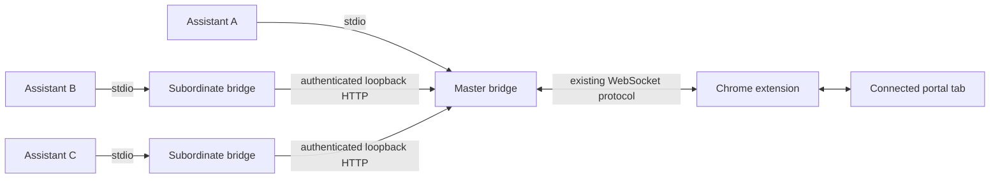

# ADR-002: Share the local bridge across MCP processes

Status: accepted. Scope: the bridge; Chrome tab selection remains unchanged.

## Problem

MCP hosts each launch a stdio server. Only one process can bind the extension's
fixed loopback port, so additional sessions previously had no browser access.

## Decision

The process that successfully binds `127.0.0.1:9224` is the master. Every other
process remains an independent stdio MCP server and forwards browser operations
through authenticated HTTP endpoints on that listener. The extension continues
using the existing WebSocket protocol. The three-tool MCP surface is unchanged.

HTTP avoids the outbound WebSocket failure documented for compiled Bun builds.
Requests carry the existing token in an Authorization header, never in a URL.
Browser origins are rejected; no CORS access is provided. The versioned endpoints
accept only bridge operations with bounded payloads and deadlines.

Each forwarded request receives a fresh UUID from the master's `Bridge.send`.
The HTTP response belongs to its originating request; replies are never broadcast
to other assistants. Closing a subordinate's request releases its pending entry
in the master. Page errors and image results keep their existing MCP representation.

Subordinates poll connection status once per second. A failed check clears their
relay and triggers another bind attempt on the next tick. The OS chooses exactly
one new master; other survivors connect to it. The extension's existing reconnect
behavior restores the browser connection. No detached daemon or lock file is needed.

In-flight operations fail on connection loss and are never replayed automatically:
a page edit might already have happened before its reply was lost. Election does
not retain page state, tool results, or a queue of operations across owners.

Simultaneous first launches publish a complete token file atomically and read the
winning token. Older servers, different tokens, and foreign listeners produce a
diagnostic while MCP stays available and retries. Startup never kills a port owner.

Hosts retain `initialize.instructions` after a bridge recovers. Those instructions
contain durable usage guidance and conditional pairing help; current connection
errors belong in tool responses and stderr. Assistants check `get_page_commands`
before diagnosing connectivity and treat successful calls as superseding earlier
errors. No tool-list change notification is needed: the tools remain the same.

Initialization and `get_context` also identify the three exposed MCP tools and the
`run_page_command` argument schema. Shared Darwinium guidance can refer to tools
from other integrations; a capability is callable through this bridge only when
the connected page lists it, using that page command's exact name and arguments.

## Limits and verification

All assistants currently share one connected tab and can affect each other's page
state. Tab routing and operation coordination are separate extension work.
Connection status can lag by one poll; takeover also waits for extension reconnect.
Old bridge versions must be updated and restarted before they can participate.

`smoke-test:eaddrinuse` uses isolated ports and token files to run multiple real
stdio servers against a simulated extension. It covers concurrent startup and
calls, authentication, result isolation, error/image forwarding, extension loss,
independent shutdown, owner exit/crash, election, and no replay. Run with `--bun`
to exercise the compiled runtime as well as Node.
